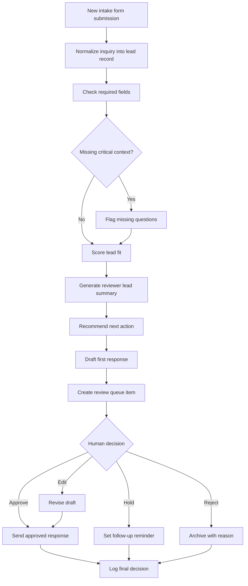

# Automation Flow

The workflow is intentionally review-first. AI can summarize, score, and draft, but the owner decides what happens next.

## Flow Diagram

## Step Details

| Step | What happens | Human control point |
|---|---|---|
| Capture | A prospect submits the intake form. | None needed. |
| Normalize | The system maps answers into consistent review fields. | Reviewer can inspect original submission. |
| Validate | Missing or weak answers are flagged. | Reviewer decides whether to ask follow-up. |
| Score | The system applies the lead scoring rubric. | Reviewer can override score or fit band. |
| Summarize | The system writes a short reviewer summary. | Reviewer can edit before logging. |
| Recommend | The system proposes approve, follow-up, hold, or reject. | Reviewer makes final decision. |
| Draft | The system prepares a first response. | Response is never sent until approved. |
| Log | Final action is recorded for follow-up. | Reviewer can add notes. |

## Review Decisions

| Decision | Use when |
|---|---|
| Approve | The inquiry is clear enough and appears relevant. |
| Edit | The draft is useful but needs a human adjustment. |
| Hold | The inquiry is not urgent or needs more context later. |
| Reject | The request is clearly out of scope or not a fit. |

## Failure Modes To Design For

- Submission is too vague to score confidently.
- Timeline is urgent but service need is unclear.
- Budget is undefined but business value may be high.
- Prospect asks for services outside the offer.
- Generated draft sounds too formal, pushy, or generic.
